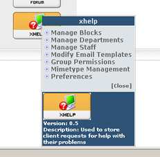
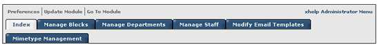
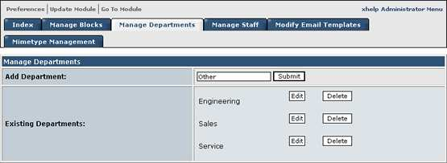
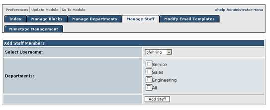
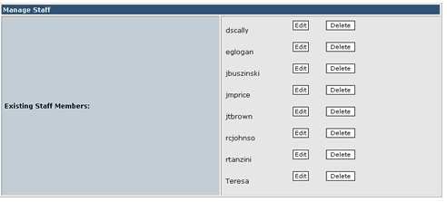
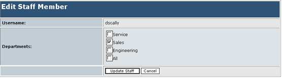
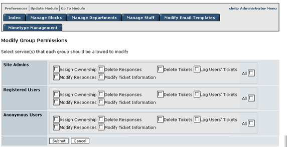
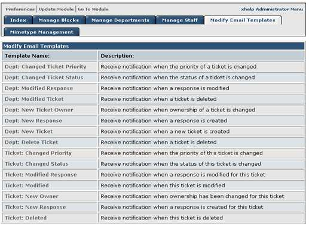

# 2.0 Administration Menu

#### Introduction

An account with administrative privileges must be used to configure xhelp.

This section will explain how to set module preferences, add departments and set up user accounts that represent help desk staff members.

#### The xhelp Administration Menus

The xhelp module is administered just like most other modules. To access the
xhelp administration menu, select Administration Menu, and hover your mouse
over the xhelp module picture

**The following areas can be administered:**

| Areas |  |
| -- | -- |
| - Blocks  - Departments - Staff  - Email Templates - Group Permissions - Mimetype Management - Preferences |  |

There is also an xhelp tabular style menu on each administration page. This is
visible when managing any of the xhelp areas, or by clicking the xhelp module
picture.

 

#### Preference Configuration

After xhelp installation, the first area to configure is the Preferences. The
Preferences contain the following module configuration options:
*  Allowing Uploads
*  Upload Size
*  Upload Width
*  Upload Height
*  Allow Ticket Re-Open
*  Announcements News Topic
*  Staff Index Ticket Count
*  Enable Notification
*  Enable Specific Events

Change the preferences to suite the needs of the module. The default Preference
settings are acceptable in most cases.

#### Department Configuration

The Departments are used to allow users to select the Department of the
organization a ticket should be submitted to. Staff members assigned to that
department will be notified when a ticket is submitted

**Department Considerations**

*  A staff member can be assigned to one or all of the Departments created.
*  Any department added will be visible to users submitting help requests
*  Departments can also be used for categories or products. The name
“Departments” can be changed to “Categories” or “Products” in order to
suit the needs of the organization. Changing the name from
“Departments” to “Categories” can be done by editing the language files.

**Adding A Department**

To add a department, select the xhelp module menu item: **Manage
Departments**

In the **Add Department:** textbox, enter the name of a department, then click
submit. The department will then be created. Create as many departments as
needed.

#### Staff Configuration

The staffs are the members of the Xoops portal responsible for administering or
answering tickets that have been submitted. Although staff members can submit
tickets, it is important to note the difference between xoops users, and xhelp staff members.

Any user that belongs to a group with the necessary permissions can submit a
help ticket, however only the “Staff” will be able to answer and close the ticket.

**Staff Considerations**

*  A staff member can not answer or view tickets that have been submitted
to departments he or she is not assigned to.
*  A staff member can be assigned to one or morel of the Departments
created.
*  It is possible to select user names and assign them to a department event
though they do not have access to the xhelp module. (so be careful)
09/24/20004 Xhelp Manual
* 8 xhelp user guide .01

**Adding Staff**

To add an xhelp Staff member, select the xhelp module menu item: **Manage
Staff**

In the “**Add Staff Members**” table, Click the **Select Username**: drop down box and choose the user name that should be assigned to a department. Then click the **Departments** the username will be assigned to. Once a username is
assigned to a department, that user name becomes a staff member.

**Editing Staff Members**

To edit a staff members Assigned Departments, select the xhelp module menu
item: **Manager Staff**

In the “**Manage Staff**” table, click the “Edit” button next to the staff member that should be edited.

Select the Departments the Selected Staff member should be assigned to, and then
click the “Update Staff button”. The user will be updated.

#### Group Configuration

The group configuration is used to set access rights and permissions to perform
specific tasks in the xhelp module.

**Group Configuration Considerations**

*  By default any user, regardless of group membership will be able to submit
an xhelp ticket.
*  It may be desirable to create additional Xoops Groups to be used specially
with xhelp.

**Modifying Group Permissions**

To Modify Group permissions, select the xhelp module menu item: **Group
Permissions**

Select the access rights for each group and click the “Submit” button to update
permissions.

#### Email Template Configuration

When a ticket is submitted, or updated in anyway, a notification can be sent to
the submitter. The notification templates may be modified to suite the
requirements of the organization.

**Template Modification Considerations and Ideas**

*  Always back up the current template set prior to making changes.
*  Adding the organization logo is a nice touch to any notification.
*  HTML can be used.
*  Including any steps the user should take for a particular status are also
helpful additions.

**Modifying Email Templates**

To modify an Email Template, select the xhelp module menu item: **Manage
Email Templates**

Click on the template that should be edited under the **Template Name**
column. The **Description**: gives the action that will trigger the template used
for the action-taking place on the ticket.

**Mimetype Management**

The Mimetype management is used to set allowable file extensions that can be
uploaded when a ticket is submitted.

**Adding/Modifying Mimetypes**

To modify or add a Mimetype, select the xhelp module menu item: **Mimetype
Management.**