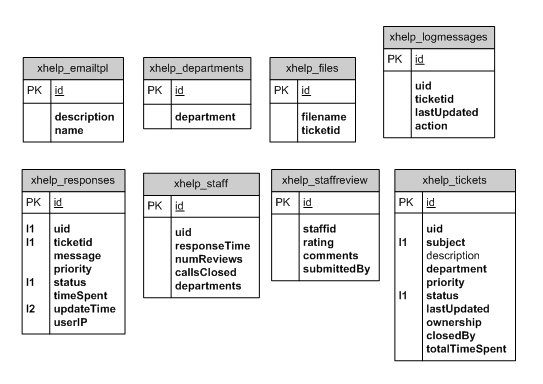

# 8.0 Technical Information & Workflows

## Custom Field Objects Model

#### xHelp Custom Fields

#### Criteria Classes

#### XoopsObjects

## Class Relationships

#### Static Structure

#### Object Relationships

## Support Plans:

#### Criteria classes

#### Customer Plans

#### XoopsObject

## Database structure

#### Admin workflow

#### Staff workflow

#### User workflow

## Smarty variables

