# Technical Information & Workflows

## Custom Field Objects Model

### xHelp Custom Fields

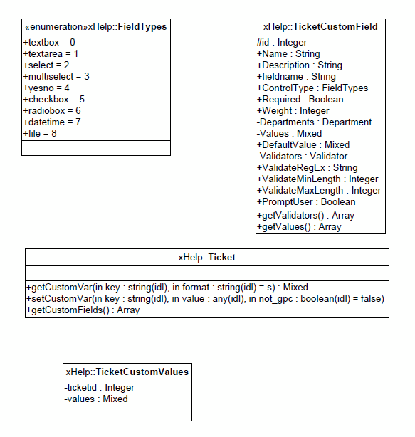

### Criteria Classes

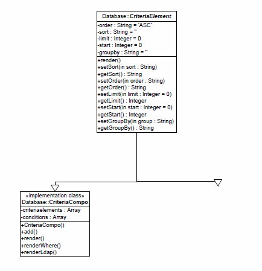

### XoopsObjects

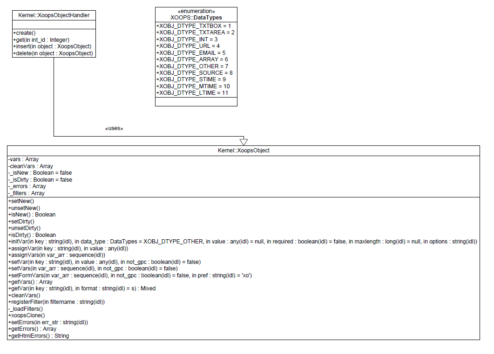

## Class Relationships

### Static Structure

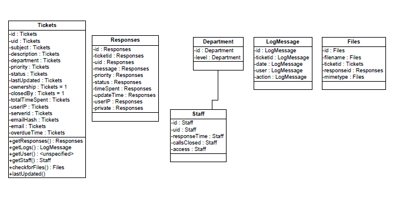

### Object Relationships

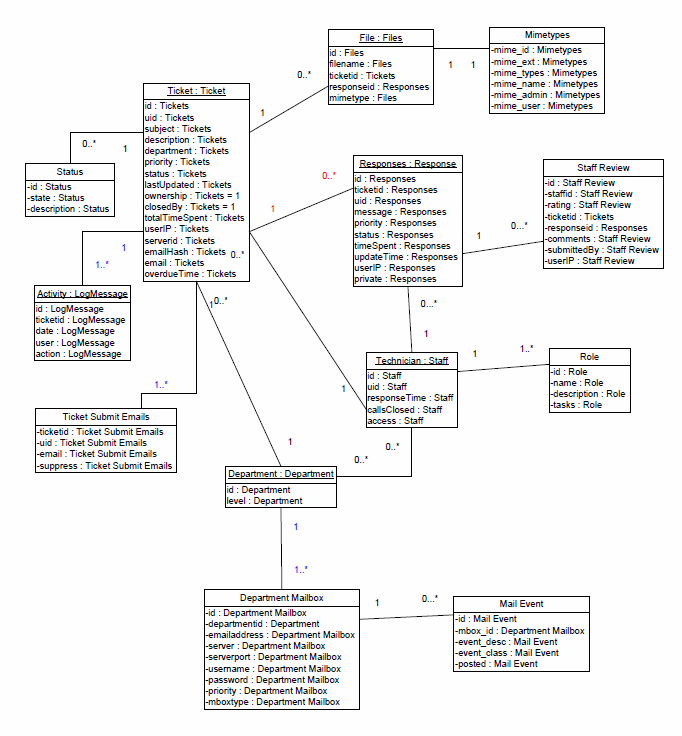

## Support Plans:

### Criteria classes

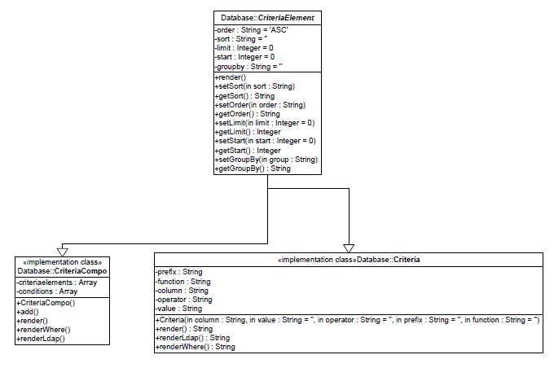

### Customer Plans

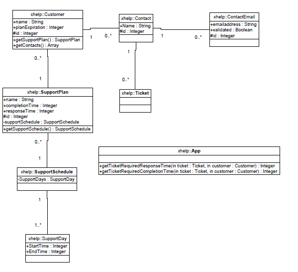

### XoopsObject

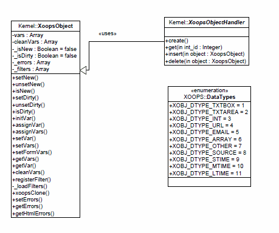

## Database structure

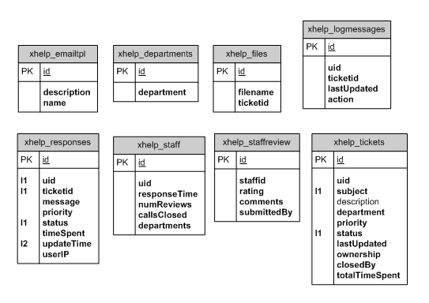

### Admin workflow

  

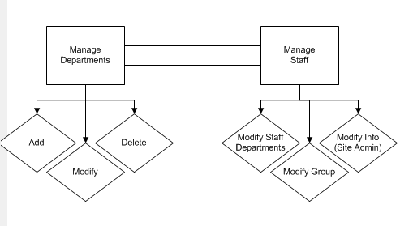

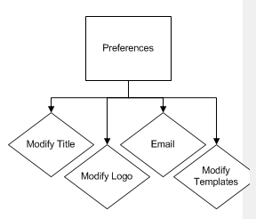

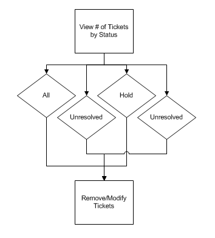

### Staff workflow

   

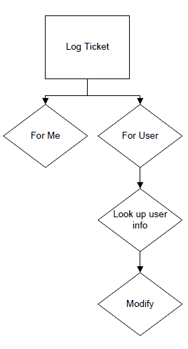

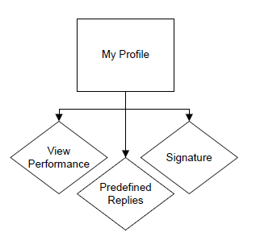

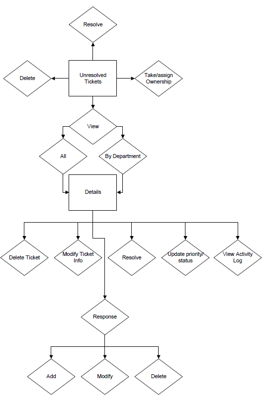

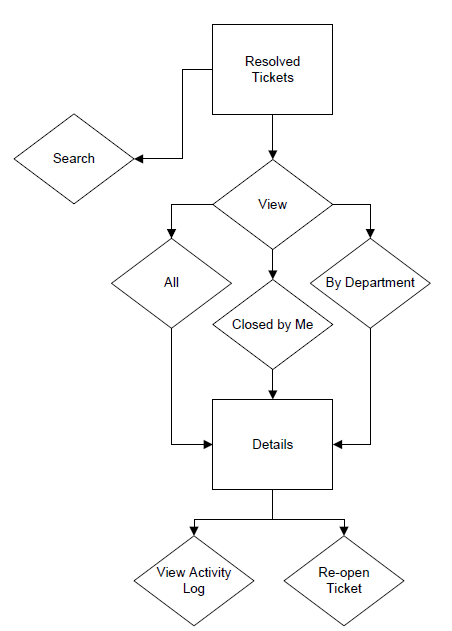

### User workflow

  

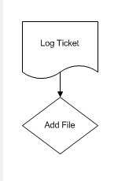

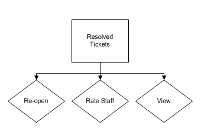

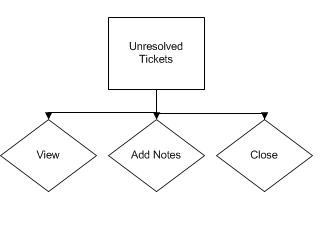

## Smarty variables

          

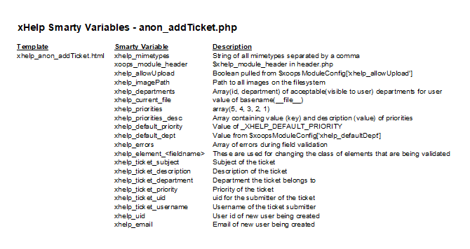

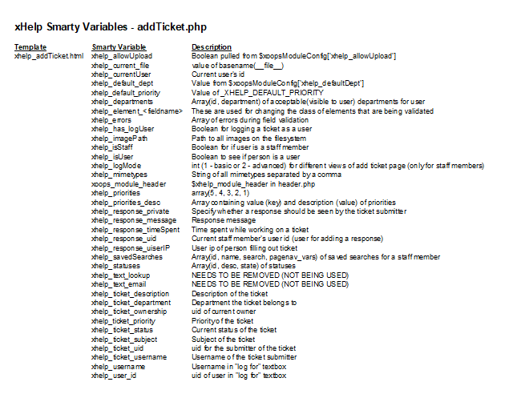

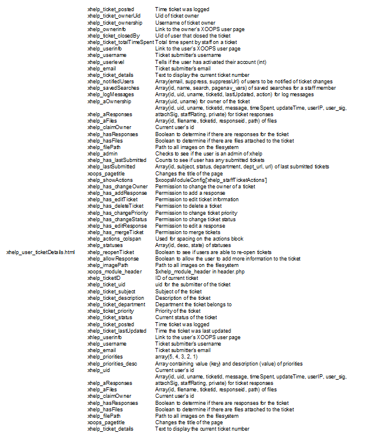

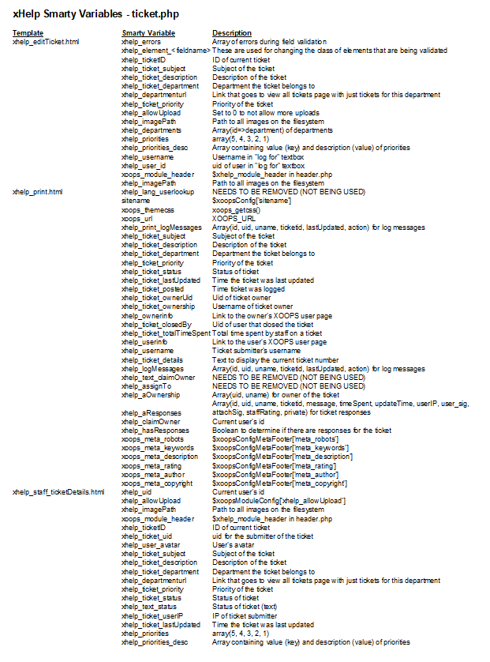

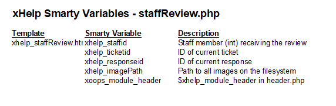

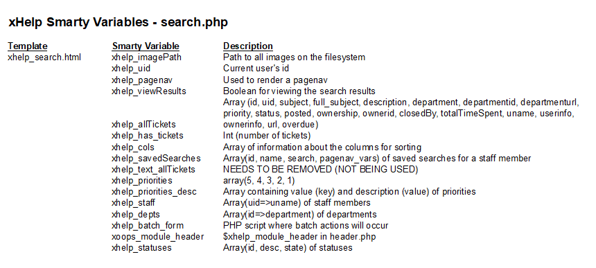

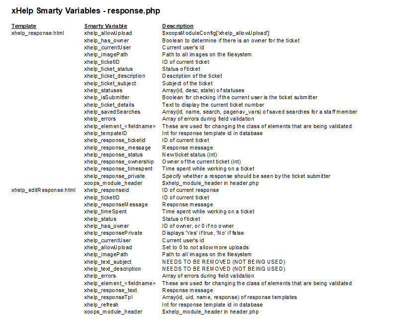

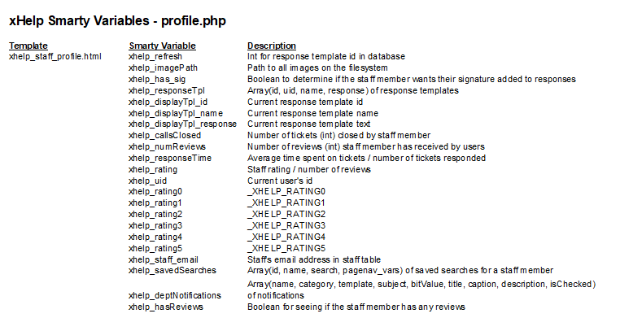

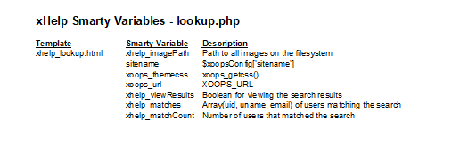

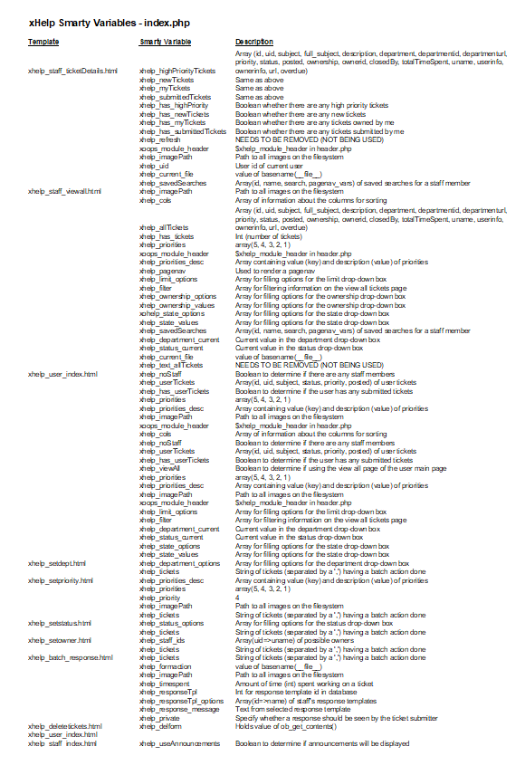

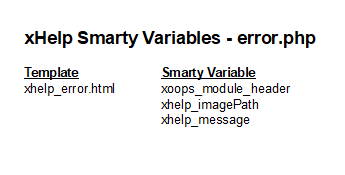

