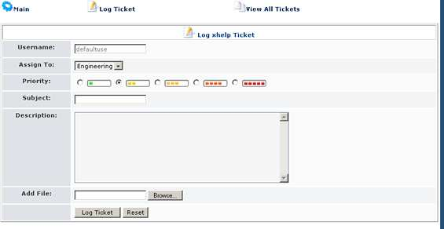
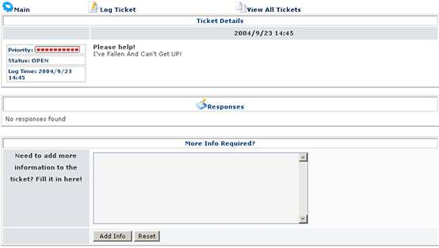
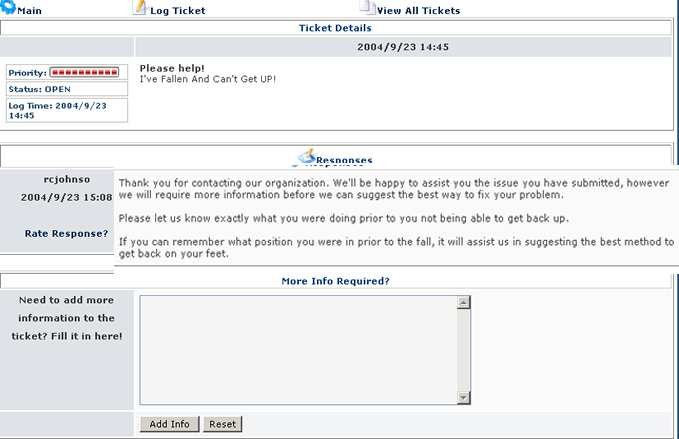
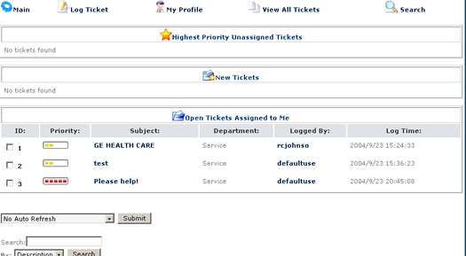
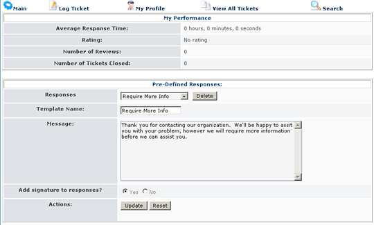
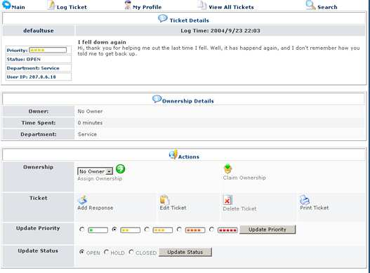
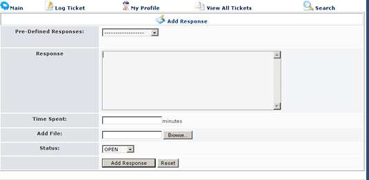
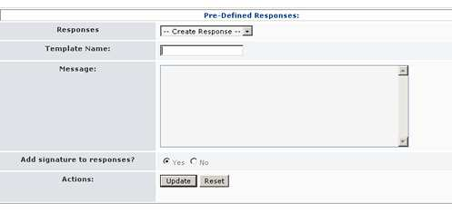

# The User Side

The xhelp system was designed with simplicity in mind. It is very easy to submit a ticket and manage the responses, notifications, and status’.

This section is broken down into two sub-sections. The first, “Using xhelp” describes how to use the xhelp system from a user standpoint, the second , “Managing xhelp Tickets”, describes managing tickets submitted by users.

## Using xhelp \(user access\)

The xhelp module allows users to submit, and view the status of any ticket they have submitted. When a user accesses the xhelp module, three areas are available:

**Main**

The **Main** area is the default screen that appears when a user accesses the xhelp module. This area displays any tickets that have not been closed by a staff member. The user can view activity such as answers and responses sent by the staff, and reopen tickets if the Preference configuration has been set to allow this action.

**Log Ticket**

The **Log Ticket** area is where a user can submit an xhelp ticket. Once a ticket has been submitted, it is considered an “open” status. The department the ticket was submitted to will be notified.

**Log Ticket Fields**

* Username – account of the logged in xoops user.
* Assign To: - the department the ticket will be submitted to.
* Priortiy – how important the problem is the the user. “green is low” , “red

  is high”

* Subject – subject of the ticket
* Description: The reason the ticket is being submitted.
* Add File: Allows the user to attach a file along with the ticket submissions.

**Log Ticket Buttons**

Log Ticket – Submits the ticket to the department selected. Reset – clears all fields.

**View All Tickets**

The **View All Tickets** area is where a user can view a list of tickets that have been submitted under their username.

**Viewing A Ticket**

To view additional information about a ticket that has been submitted, such as submission date, staff responses or status changes, click the subject line of the ticket.

**Adding Additional Information**

Any response submitted by xhelp staff members will appear. A staff member may require additional information, or the user may wish to add additional information about the request.

To Answer or add additional information, enter the text into the “More Info Required” text box and click the “Add Info” button. Each time a ticket is submitted, the department staff and the user will be notified.

## Staff Access xhelp Overview

The xhelp module allows Staff and Department Members to view the status of any ticket submitted to a department where they have been assigned membership. This section assumes the Department Member has full administrative rights to the xhelp module.

**Staff Access xhelp Navigation**

When a staff member enters the xhelp section. The following areas are available:

**Main**

The **Main** area is the default screen that appears when a staff member accesses the xhelp module. This area displays new tickets, tickets that have not yet been assigned to a staff member, and tickets assigned to the currently logged on staff member.

Configuration options also allow the staff member to set refresh preferences and perform word searches for tickets.

| Staff Access | Ticket Tables |
| --- | --- |
| **Priority Unassigned Tickets** | This table displays help requests that have have not yet been processed or assigned to a staff member. Only tickets with a high priority will be shown here. |
| **New Tickets** | This table shows tickets that have been submitted, but not yet been assigned to a staff member for processing. All tickets will appear here regardless of the priority. |
| **Open Tickets Assigned To Me** | This table shows tickets that the user has taken ownership of, or been assigned to. |

**Log Ticket**

The **Log Ticket** area is where a user or staff member submit an xhelp ticket. Once a ticket has been submitted, it is considered an “open” status. The department the ticket was submitted to will be notified. The Log Ticket area works the same way for “Users” and Staff members.

**My Profile**

The **My Profile** area is used to check the logged in staff members performance and rating reviews. This area is also where “Pre-Defined” responses can be created and inserted into a reply to a submitted ticket. At this time, only one response template can be used per response.

**Ticket Actions**

When a ticket has been submitted, there are different actions that a staff member can do with the ticket: To take action of a ticket, click the subject line of any table that it appears in and the Ticket Details will be provided.

**Possible Actions**

| Name | Details |
| --- | --- |
| **Ownership** | To take ownership of a submitted ticket, click the “Claim Ownership” icon. Assigning a ticket to another staff member can also be performed. _Once a ticket has been assigned, or claimed, it is no longer considered “New”._  |
| **Ticket** | The staff member can Respond, Edit, Delete or Print the ticket |
| **Update Priority** | The ticket priority can be adjusted |
| **Update Status** | The status can be updated. A ticket can be closed from this menu. |

**Ticket Details**

The ticket details displays any responses that have been made, a history of actions that have taken place since the ticket was opened, and other tickets that have been opened by the user. Additional notification options can also be set.

This can be a very valuable area to find additional information and problem history

**Search**

The search function allows staff members to search other submitted tickets. It is possible to search in the Description or Subject Field, and limit the number or results returned per page.

## Managing xhelp Tickets

When a user, or another staff member submits a ticket, it will be sent to a Department, where the department lead or members can assign, take ownership, respond, edit, delete, and/or print the ticket.

**Assigning And Taking Ticket Ownership**

Although once a ticket is submitted, any action can take place, it is best to first claim the ticket, or assign it to another staff member.

_**Assign Ownership:**_

To assign ownership to a staff member, click the subject of the ticket, to load the Ticket Details view, and select the Staff members name from the drop down box.

_**Claim Ownership**_

To claim ownership, click the subject of the ticket, to load the Ticket Details view, and select the Claim Ownership icon.

**Responding To an xhelp Ticket**

To respond to a submitted ticket, or a ticket that has been assigned, click the subject of the ticket, and select “Add Response” from the Action Table.

A Pre-Defined Response can be entered along with additional information. A ticket status can also be updated along with the response. Once the response has been entered, click the “Add Response” button.

**Creating Pre-Defined Responses**

To create a Pre-Defined response, select “Create Response” from the “Responses” drop down list. Enter the message that should be inserted into a reply into the “Message” text box and set the Signature option. Click the “Update” button to save the response 

